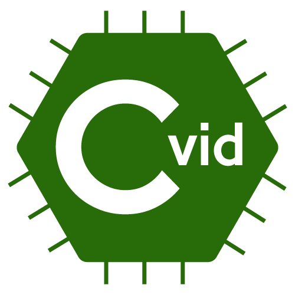

# C-vid
<a href="url"></a>
Lenguaje de programación C-vid, desarrollado para el curso Fundamentos de Lenguajes de programación de la Universidad del Valle

## Gramática del lenguaje:

```
;producciones de la léxica
;<identificador> ::= <letter> | {<letter> | 0,...,9}*
;<letter>        ::= A...Z | a...z
;<numero>        ::= [-]{0,...,9}* | [-]{0,...,9}* . {0,...,9}*
;<octal>         ::= x8 "("{0,...,7}+( )")"
;<caracter>      ::= (')<letter>(')
;<cadena>        ::= ("){<caracter>}*(")
;<bool>          ::= true | false

;<programa>      ::= <globales> <expresion>
;<globales>      ::= "("{<identificador> = <expresion>}")"*(,)

;producciones de tipo expresión
;<expresion>     ::= <identificador>
;                ::= &<identificador>
;                ::= var "(" {<identificador> = <expresion>}*(,) ")" in <expresion>
;                ::= sta "(" {<identificador> = <expresion>}*(,) ")" in <expresion>
;                ::= rec {<identificador> "(" {<identificador>}*(,) ")" = <expresion>}* in <expresion>
;                ::= @value
;                ::= unic "(" {<identificador> = <expresion>}*(,) ")" in <expresion>
;                ::= <octal>
;                ::= <numero>
;                ::= <caracter>
;                ::= <cadena>
;                ::= <lista>
;                ::= <vector>
;                ::= <registro>
;                ::= <expr-bool>
;                ::= sequence "(" {<expresion>}+(;) ")" end
;                ::= if "(" <expr-bool> ")" then <expresion> "[" else <expresion> "]" end
;                ::= cond { "[" <expresion> <expresion> "]" }* else <expresion>} end
;                ::= while "(" <exp-bool> ")" do <expresion> done
;                ::= for "(" <identificador> = <expresion> ")" (to | downto) <expresion> do <expresion> done

;expresiones adicionales 
;<expresion>     ::= ":" "(" <expresion> <arit-prim> ")"
;                ::= "o:" "(" <expresion> <arit-prim-octal> ")"
;                ::= <cad-prim>
;                ::= <list-prim> "(" <expresion> ")"
;                ::= <vect-prim> 
;                ::= <reg-prim> 
;                ::= define <identificador> "lambda" "(" {<expresion>}* ")" <expresion>       
;                ::= set <identificador> "=" <expresion>
;                ::= "(" <expresion> {<expresion>}* ")"
 
;primitivas de cadenas
;<cad-prim>      ::= longitud "(" <expresion> ")"
;<cad-prim>      ::= concatenar "(" {<expresion>}*(,) ")"

;---------- LISTAS -----------
;<lista>         ::= "[" {<expresion>}*(;) "]"
;                ::= vacia
;                ::= cons "(" <expresion> <expresion> ")"
;                ::= append "(" <expresion> <expresion> ")"

;primitivas de listas
;<expr-bool>     ::= lista? "(" <expresion> ")"
;                ::= vacio? "(" <expresion> ")"
;<list-prim>     ::= cabeza | cola

;---------- VECTORES -----------
;<vector>        ::= vector "[" {<expresion>}*(;) "]"

;primitivas de vectores
;<expr-bool>     ::= vector? "(" <expresion> ")"
;<vect-prim>     ::= ref-vector "(" <numero> de <expresion> ")"
;                ::= set-vector "(" <expresion> en <numero> de <expresion> ")"

;---------- REGISTROS -----------
;<registro>      ::= "{" {<identificador> ":" <expresion>}+(,) "}"

;primitivas de registros
;<expr-bool>     ::= registro? "(" <expresion> ")"
;<vect-prim>     ::= ref-registro "(" <identificador> de <expresion> ")"
;                ::= set-registro "(" <expresion> en <identificador> de <expresion> ")"

;---------- BOOLEANOS -----------
;expresiones booleanas
;<expr-bool>     ::= <bool>
;                ::= compare "(" <expresion> <pred-prim> <expresion> ")"
;                ::= <oper-bin-bool> "(" <expr-bool> "," <expr-bool> ")"
;                ::= ¿ <expresion> <expresion>
;                ::= not "(" <expr-bool> ")"

;operadores booleanos
;<oper-bin-bool> ::= and | or | xor

;predicado de primitivas
;<pred-prim>     ::= < | > | <= | >= | == | <>

;---------- ARITMÉTICA -----------
;primitivas aritméticas para decimales
;<arit-prim>     ::= + | - | * | % | / | ++ | --

;primitivas aritméticas para octales
;<arit-prim-octal>     ::= + <expresion>
;                      ::= - <expresion>
;                      ::= * <expresion>
;                      ::= ++ <expresion>
;                      ::= -- <expresion>
```
